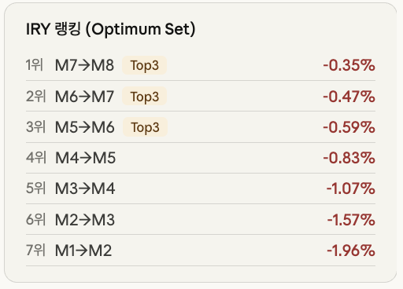
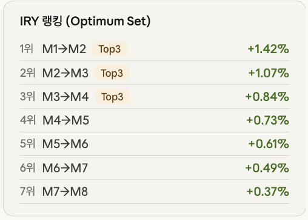

# WTI 원유 선물 ETN — GSCI Rank 기반 동적 롤오버 (DRA) 모델링

> **Y-FoRM (Yonsei Forum of Risk Management) 26-1 1차 프로젝트**
> *「비용 최소화 동적 롤오버 전략을 활용한 환헤지형 원유 선물 ETN 모델링」*
> (Modeling FX-Hedged Oil Futures ETNs — Fixed vs. Dynamic Oil Futures Rollover Strategies)

이 레포는 **팀 프로젝트 중 본인이 담당한 「DRA (GSCI) Rank-Based Dynamic Rollover」 파트**의
방법론 문서·구현 코드·백테스트 산출물을 정리한 것입니다.

- 팀 구성: Y-FoRM 38기, 39기
- 본인 담당: **DRA(3) GSCI 동적 롤오버 지수 설계 및 구현, 정적 롤오버 대비 성과·비용 비교 분석**
- 팀의 다른 파트(Bloomberg 고정 롤오버 기초지수, 슬로프 기반 동적 롤오버, 원유선물 델타헤징,
  달러선물 FX 헤징)는 이 레포의 범위 밖이며, 비교 맥락을 위해 README에서만 요약합니다.

---

## 1. 문제의식

국내 파생결합증권 중 거래량이 가장 큰 축인 **원유선물 ETN**은 구조적 한계를 안고 있습니다.

- 대부분의 원유 ETN이 추종하는 기초지수는 **고정된(기계적) 롤오버**를 씁니다.
  매월 정해진 5영업일에 걸쳐 20%씩 근월물(Lead) → 차근월물(Next)로 비중을 옮깁니다.
- 원유 선물 커브가 **콘탱고(Contango)** 일 때, 이 방식은 싼 근월물을 팔고 비싼 차월물을 사는
  일을 시장 상황과 무관하게 반복합니다 → **음(-)의 롤일드**가 확정 손실로 누적됩니다.
- 이 비용은 양쪽을 동시에 갉아먹습니다.
  - **투자자**: 유가가 올라도 ETN 가치가 하락하는 가치 훼손
  - **발행 증권사**: ETN 숏 포지션을 원유선물 롱으로 델타헤지하는 과정에서 롤 비용·수수료·
    호가 슬리피지를 지속 지출

> **프로젝트 목표** — 기계적 롤오버를 벗어난 **동적 롤오버 전략 지수**를 개발해 롤일드 비용을
> 최소화하고, 이 지수를 ETN으로 발행했을 때 절감된 롤 비용이 발행사의 실제 헤징 비용
> (마찰 비용, FX 등)을 커버하고도 알파를 창출할 수 있는지 모델링·검증한다.

팀은 두 가지 동적 롤오버를 만들어 고정 롤오버 기초지수와 비교했습니다.

| 전략 | 월물 선택 기준 |
|---|---|
| **Fixed (기초지수)** | Bloomberg WTI Crude Oil Single Index — 매월 Lead → Next 고정 교체 |
| **Slope Dynamic** | 기간구조 로그 기울기(하루당 롤 비용)가 최소가 되는 월물 선택 |
| **GSCI Dynamic (DRA)** | **← 이 레포**. S&P GSCI Dynamic Roll Algorithm의 IRY 랭킹 기반 선택 |

---

## 2. 이 레포가 다루는 것 — DRA (Dynamic Roll Algorithm)

S&P Dow Jones Indices의 **S&P GSCI Dynamic Roll Methodology (2024-12)** 를
WTI 원유(CL) 단일 상품 지수에 맞춰 각색한 구현입니다.

### 2-1. Implied Roll Yield (IRY)

선물 커브 상 **연속된 두 계약**(consecutive pair) 사이의 내재 롤 수익률:

```
IRY_C(i, j) = [ C(i, j-1) − C(i, j) ] / [ C(i, j) × Interval_D ]
```

| 기호 | 의미 |
|---|---|
| `C(i, j)` | 월 i 기준 j번째(뒤, 더 원월) 선물 계약의 결제가 — **롤인 대상** |
| `C(i, j-1)` | 그 직전(앞, 더 근월) 계약의 결제가 |
| `Interval_D` | 두 계약의 만기월 차이(개월). 인접 계약이면 1 |

- `IRY < 0` → 콘탱고 구간. 롤인 시 **비용** 발생
- `IRY > 0` → 백워데이션 구간. 롤인 시 **이득** 발생
- IRY가 클수록 그 계약으로 롤인하는 것이 유리 → **Optimum Set 선정 기준**

> 방법론상 IRY는 **반드시 인접 페어**로 계산합니다. `M1→M3` 같은 건너뛴 페어
> (Slope Score 방식)는 GSCI DRA 방법론이 아닙니다.

### 2-2. Rank Order와 Optimum Set

모든 연속 페어의 IRY를 계산해 **내림차순 정렬**하고, 상품별 **Rank Order k** 상위 k개
계약으로 Optimum Set을 구성합니다. **WTI 원유(CL)의 Rank Order는 3** → **DRA(3)**.

```
Optimum Set = { Best(1), Best(2), Best(3) }
```

### 2-3. Dynamic Roll Parity Principle (핵심)

| 조건 | 결정 |
|---|---|
| 현재 보유 계약 ∈ Optimum Set | **PASS** — 롤오버 없이 현 월물 그대로 유지 (거래 없음) |
| 현재 보유 계약 ∉ Optimum Set | **ROLL** — Best(1) 계약으로 롤오버 실행 |

이 원칙이 불필요한 교체를 억제하는 버퍼 역할을 합니다.
백워데이션 구간에서는 근월물이 자연스럽게 Optimum Set에 포함되므로 롤이 억제되고,
콘탱고 구간에서는 상대적으로 커브 기울기가 완만한 원월물 구간이 Optimum Set이 되어
월별 롤 비용이 최소화됩니다.

<p align="center">
  
  
</p>

### 2-4. WTI 단일 상품 적용 시 각색 사항

| 항목 | S&P GSCI 원본 | 본 구현 |
|---|---|---|
| Roll Determination Date | BD3 | **BD6** (Bloomberg Single Index 롤 시작일과 정렬) |
| Roll Period | BD5 ~ BD9 | **BD6 ~ BD10** (5영업일, 매일 20%씩 비중 이전) |
| 유동성 필터 (MDVT/MDOI 연간 적격심사) | 적용 | **미적용** (단일 상품 + WTI는 항상 적격) |
| 후보 계약 범위 | Dynamic Roll Matrix | **만기 미도래 최대 12개 월물 (M1~M12)** |
| Rank Order | CL = 3 | 동일 (**DRA(3)**) |

### 2-5. 지수 산출 (ER / TR)

롤오버 규칙만 DRA로 바꾸고, 지수 산출식은 Bloomberg Single Commodity Index 방법론을 그대로 씁니다.

```
WAV_t  = Σ [ CIM × YLRW × (LCSP_t / L)  +  CIM × YNRW × (NCSP_t / L) ]
PWAV_t = Σ [ CIM × YLRW × (LCSP_t-1 / L) + CIM × YNRW × (NCSP_t-1 / L) ]

DER_t     = WAV_t / PWAV_t − 1
IndexER_t = IndexER_t-1 × (1 + DER_t)

IR_t      = [ 1 / (1 − (91/360) × TBR_t-1) ] ^ (D/91) − 1
IndexTR_t = IndexTR_t-1 × ( IndexER_t / IndexER_t-1 + IR_t )
```

- `YLRW / YNRW` : 전일 기준 Lead / Next 롤 가중치
- `LCSP / NCSP` : 당일 Lead / Next 결제가, `L` = 계약 승수(1,000 bbl)
- `TBR` : 최근 경매된 13주(91일) 미 T-Bill 고할인율 (TR 지수의 현금 담보 이자수익)
- MDE(Market Disruption Event) 발생일의 롤은 보류 후 다음 정상 영업일에 누적 반영
- Base: 2016-01-04 = 100.0 (ER·TR 공통), 소수점 8자리 반올림

---

## 3. 백테스트 결과

**기간 2016-01-04 ~ 2026-03-18 (123개월), AUM 10M USD 고정, WTI 선물 1계약 = 1,000배럴**

> **수치 표기 원칙**
> 성과 지표(수익률·변동성·MDD·샤프·소르티노·칼마·베타·누적 롤일드)는
> **팀 발표자료(96p PDF)에 보고된 공식 수치를 기준값**으로 싣습니다 (§3-2).
> 본 레포 코드를 재실행해 얻은 값은 §3-3에 별도로 병기하고, 차이가 나는 이유를 밝혔습니다.
> 발표자료에 없는 세부 항목(롤 실행 횟수, 체결 금액, 발행사 비용 절대액 등)은
> 레포 산출치를 그대로 유지하며 그 사실을 각 절에 표기했습니다.

### 3-1. 롤 실행 빈도 — "거래를 안 하는 것"이 가장 큰 절감

| 항목 | 정적 (ETN 벤치마크) | 동적 (DRA) |
|---|---|---|
| 분석 월수 | 123 | 123 |
| 실제 롤 실행 | 123회 (100%) | **60회 (49%)** |
| 월물 유지(거래 없음) | 0회 | **63회 (51%)** |
| 총 롤오버 순수 IRY 합계 | −0.3307 | **−0.1221** (절감 +0.2086) |
| 총 체결 금액 | $7,836,450,000 | **$3,888,702,000** |
| 체결 금액 절감률 | — | **−50.38%** |

Parity Principle이 절반의 달에서 롤을 억제한 결과, 회전율과 그에 비례하는
수수료·호가 슬리피지가 구조적으로 반토막 났습니다.
→ `results/summary/cumulative_summary.csv`, `annual_summary.csv`, `pure_roll_yield.csv`

> 이 절의 수치는 **발표자료에 해당 세부 항목이 없어 레포 산출치를 유지**한 것입니다.
> (발표자료는 세 전략의 연평균 총 헤지비용 추이를 bps 그래프로만 제시하고,
> 롤 실행 횟수·체결 금액은 표로 보고하지 않았습니다.)

### 3-2. 투자자 관점 성과 — 발표자료 공식 수치

출처: 발표자료 **p.47 「8. Results Analysis – Investor's Perspective — 성과지표의 해석」**
(동일 조건에서 세 전략을 함께 재산출한 팀 최종 비교표)

| 지표 | Fixed (Bloomberg) | Slope Dynamic | **GSCI Dynamic (DRA)** |
|---|---|---|---|
| 연환산 수익률 (%) | 8.25 | 11.55 | **12.67** |
| 연환산 변동성 (%) | 46.12 | 43.60 | **32.91** |
| MDD (%) | −89.50 | −84.67 | **−54.23** |
| 샤프 비율 | 0.41 | 0.48 | **0.53** |
| 소르티노 비율 | 0.21 | 0.31 | **0.49** |
| 칼마 비율 | 0.09 | 0.14 | **0.23** |
| 베타 | 0.98 | 0.88 | **0.69** |

같은 지표를 소수 3자리로 표기한 발표자료 **p.46 「성과지표 비교 (이상치 제거, 전체 기간)」**
막대그래프의 값은 다음과 같습니다 — 연환산수익률 0.083 / 0.115 / **0.127**,
연환산변동성 0.461 / 0.436 / **0.329**, MDD −0.895 / −0.847 / **−0.542**,
샤프 0.411 / 0.478 / **0.529**, 소르티노 0.215 / 0.312 / **0.491**,
칼마 0.092 / 0.136 / **0.234**, 베타 0.979 / 0.879 / **0.686**
(순서: Bloomberg / Slope Dynamic / GSCI Dynamic).

**지수 최종 레벨** (발표자료 p.44 「ETN 지수 성과지표 해석」, Base 2016-01-04 = 100)

| 지수 | Fixed (Bloomberg) | Slope Dynamic | **GSCI Dynamic (DRA)** |
|---|---|---|---|
| ER | 177.8 | 241.1 | **267.0** |
| TR | 224.0 | 303.8 | **336.8** |

> p.44 TR 차트의 범례에는 GSCI Dynamic이 `336.3`, 슬라이드 하단 텍스트에는 `336.8`로
> 적혀 있습니다. 본 레포 재실행값(336.32)은 차트 범례와 일치합니다.

**누적 롤일드 ($)** (발표자료 p.45 「누적 롤일드」)

| Fixed (Bloomberg) | Slope Dynamic | **GSCI Dynamic (DRA)** |
|---|---|---|
| +6.62 | +19.43 | **+14.17** |

**발표자료 p.42–43에 명시된 지표 정의** (레포 재산출값과의 차이를 읽을 때 필요)

| 지표 | 기준 | 산식 |
|---|---|---|
| 연환산 수익률 | **TR** | `(TR 마지막값 / TR 첫값)^(252/N) − 1` |
| 연환산 변동성 | ER | `std(일간수익률) × √252` |
| MDD | ER | `min((TR − 누적최댓값) / 누적최댓값)` |
| 샤프 | ER | `(일간수익률 평균 / 일간수익률 표준편차) × √252` |
| 소르티노 | ER | `연환산수익률 / (하방수익률 표준편차 × √252)` |
| 칼마 | ER | `연환산수익률 / \|MDD\|` |
| 베타 | **TR** | `Cov(자산 수익률, 시장 수익률) / Var(시장 수익률)` |
| 순수 롤일드 | ER | 롤 진행일(`0 < lead_weight < 1`)만 사용, 롤오버 이벤트별 `mean(lead_price − next_price)` 합산 |

발표자료 p.47의 결론 요지 — GSCI 동적 롤오버 지수는 지난 10년(2016~2025) 기준
**연환산 수익률 1위·변동성 최저**, MDD를 고정 롤오버 지수의 **절반 수준으로 방어
(−54% vs −89%)**, 소르티노·칼마 모두 1위. 그 원동력은 **베타 0.69**(유가가 1% 움직일 때
지수는 0.69%만 반응)라는 낮은 현물 민감도이며, Slope Dynamic은 베타 0.88로
Bloomberg와 GSCI의 중간에 위치하는 중도형 전략으로 평가되었습니다.

### 3-3. 본 레포 코드 재실행 결과 및 발표자료와의 차이

`reference/ws_1_index.py` → `ws1_compare.py` 를 재실행해 얻은 값입니다.
→ `results/summary/summary_stats.csv`

| 지수 | 최종값 | 누적수익 | 연환산수익 | 연환산변동성 | MDD | 샤프 | 소르티노 | 칼마 | 근월물 베타(ER) |
|---|---|---|---|---|---|---|---|---|---|
| 정적 ER | 177.83 | 77.83% | 5.66% | 45.49% | −89.81% | 0.357 | 0.423 | 0.063 | 0.136 |
| 정적 TR | 224.05 | 124.05% | 8.02% | 45.49% | −89.50% | 0.406 | 0.480 | 0.090 | — |
| **DRA ER** | **266.95** | **166.95%** | **9.85%** | **32.46%** | **−55.58%** | **0.453** | **0.571** | **0.177** | **0.087** |
| **DRA TR** | **336.32** | **236.32%** | **12.30%** | **32.46%** | **−54.23%** | **0.522** | **0.656** | **0.227** | — |

**두 수치가 다른 이유** (수치를 임의로 고른 것이 아니라, 산출 조건이 다릅니다)

1. **이상치 처리** — 발표자료 p.46의 표 제목은 「성과지표 비교 (**이상치 제거**, 전체 기간)」로,
   2020년 4월 WTI 마이너스 유가 국면 등 극단 관측치를 제거한 뒤 지표를 산출했습니다.
   본 레포는 전 영업일을 제거 없이 사용합니다. 표본 수(N)가 달라지므로 연환산 수익률도
   달라집니다 (DRA TR 12.67% vs 12.30%, Fixed TR 8.25% vs 8.02%).
2. **베타 산출 기준** — 발표자료 베타는 **TR 기준·이상치 제거 후** 값(DRA 0.686)이고,
   레포의 `근월물베타`는 **ER 기준·이상치 제거 없음**입니다. 2020년 구간의 연도별 베타가
   정적 0.062 / DRA 0.022까지 붕괴하면서 전체 구간 회귀를 끌어내려, 레포값이 0.087로
   나옵니다. 실제로 2020년을 제외한 연도별 DRA 베타는 0.72~0.97 범위이고
   (`results/summary/summary_stats.csv` 의 「연도별 근월물 베타」 섹션),
   그 평균대가 발표자료의 0.69와 정합합니다.
3. **소르티노** — 두 산출이 하방편차 분모를 다르게 정의해 차이가 가장 큽니다
   (발표자료 0.491 vs 레포 0.656). 발표자료 정의는 위 §3-2의 정의 표를 따릅니다.
4. **일치하는 항목** — 지수 최종 레벨(ER 177.8/267.0, TR 224.0/336.3)과 **MDD(−89.50% /
   −54.23%)** 는 두 산출이 동일합니다. 즉 지수 산출 엔진 자체는 같고,
   차이는 사후 성과지표 집계 단계에서만 발생합니다.

### 3-4. 시장 국면별 성과

**발표자료 p.48 「시장 국면(Regime)별 분석 및 최종 결론」 — 연 단위 대표 국면**

| 국면 | 예시 연도 | 결과 |
|---|---|---|
| 유가 강세장 (Bull) | 2021 | **고정 롤오버 승** — 높은 베타(0.98)가 상승분을 온전히 추종. GSCI(0.69)는 원월물에 위치해 상승 참여도가 낮음 (기회비용) |
| 유가 약세장/위기 (Bear) | 2020 | **GSCI 압도적 승** — Bloomberg **−43%** vs GSCI **−21%** |
| 유가 횡보장 (Flat) | 2023 | **GSCI 승** — Bloomberg **−1.6%** vs GSCI **+2.2%** |

**본 레포의 국면 구간별 누적 수익률 (%)** — 발표자료보다 세분화된 구간으로,
레포 자체 산출치입니다 (발표자료에는 아래 구간 단위 표가 없어 유지).

| 국면 | 기간 | 정적 ER | DRA ER |
|---|---|---|---|
| 강한 콘탱고 | 2016-01 ~ 2016-03 | −10.40 | **−6.00** |
| 평범/혼조세 | 2017-01 ~ 2019-12 | −4.80 | **+23.33** |
| 슈퍼 콘탱고 | 2020-03 ~ 2020-05 | −43.16 | **−22.39** |
| 슈퍼 백워데이션 | 2022-02 ~ 2022-08 | +14.84 | **+16.80** |
| 강한 백워데이션 | 2025-07 ~ 2026-03 | **+57.11** | +34.01 |

**해석** — DRA는 강세장에서 상승분 일부를 포기하는 대신, 약세장·횡보장에서 압도적 우위를
점하는 **방어형** 프로파일입니다. 저변동성 원월물 구간에 포지션을 두어 얻은 **의도된 둔감함**이
방어력의 원천이며, 그 대가로 유가 급등 국면(2025~2026 강한 백워데이션)에서는 기초지수 대비
상승 참여도가 낮습니다.

### 3-5. 발행사(증권사) 관점 — 헤징 비용

발표자료 **p.49 「8. Results Analysis – Issuer's Perspective — 총 비용」** 은 세 모델의
**연평균 총 헤지비용 추이(2016–2025, bps, AUM 10M USD 대비)** 를 그래프로만 제시하며,
"기계적 롤오버에서 가장 높은 거래비용이 도출된다"는 결론을 냅니다 (막대/점 라벨 수치 없음).
따라서 아래 절대액 표는 **발표자료에 해당 항목이 없어 레포 산출치를 유지**한 것입니다.
→ `results/summary/summary_stats_issuer_liquidity.csv`

| 지수 | 연간 회전율 | 연간 수수료 | 연간 스프레드 | 연간 총비용 | 비용/AUM |
|---|---|---|---|---|---|
| 정적 ER | 51.4x | $13,395 | $89,302 | $102,698 | **1.027% p.a.** |
| DRA ER | **25.9x** | $6,357 | $42,381 | $59,764 | **0.598% p.a.** |

비용 파라미터는 팀 공통 가정(발표자료 p.32–33)을 따릅니다 —
계약 승수 1,000배럴, 계약당 수수료 **1.5 USD**, 명목 **10,000,000 USD**,
호가 스프레드는 거래량 하위 10% 구간 **0.02 USD** / 그 외 **0.01 USD**,
슬리피지는 mid price 체결 가정에 따라 **스프레드의 1/2**.

롤 횟수 감소가 곧 델타헤지 거래량 감소이고, 이는 수수료와 호가 스프레드 지출을
직접 절감시킵니다. 다만 롤을 한 번에 몰아서 실행하기 때문에 **롤량/ADV 비율은 상승**
(평균 0.02% → 0.40%, 최대 0.34% → 15.8%)하여, 대규모 AUM에서는 시장 충격 비용과
유동성 제약이 새로운 병목이 됩니다.

### 3-6. 차트

| 파일 | 내용 |
|---|---|
| `results/charts/chart1_cumulative.png` | 정적 vs DRA 누적 지수 (ER/TR) |
| `results/charts/chart2_annual_returns.png` | 연도별 수익률 |
| `results/charts/chart2_execution_amount.png` | 월별 롤 체결 금액 비교 |
| `results/charts/chart3_roll_yield.png` | 누적 롤일드 |
| `results/charts/chart4_rolling_metrics.png` | 롤링 변동성·샤프·베타 |
| `results/charts/chart5_regime.png` | 시장 국면별 성과 |
| `results/charts/chart8_beta_scatter.png` | 근월물 대비 베타 산점도 |
| `results/charts/comparison_chart.png` | 종합 비교 대시보드 |
| `results/charts/{contango,backwardation}_*.png` | DRA 선택 로직 예시 (커브 / IRY 랭킹 / Optimum Set) |
| `results/charts/rollover_{o,x}.png` | ROLL / PASS 시나리오 도식 |

---

## 4. 레포 구조

```
.
├── README.md
├── requirements.txt
├── run_backtest.py                     # src/ 파이프라인 엔트리포인트
├── index_calculator.py                 # Bloomberg Single Index (정적 롤오버) 산출 엔진 — 팀 공통 베이스 모듈
│
├── src/                                # 모듈화된 DRA vs 정적 백테스트
│   ├── data_loader.py                  #   결제가 CSV 로딩 → wide 포맷 + 만기 맵
│   ├── roll_yield.py                   #   IRY 계산 (연속 페어) + 정적 Lead→Next IRY
│   ├── dra.py                          #   DRA(3): Optimum Set 구성 + Parity Principle
│   ├── execution.py                    #   롤 기간(BD6~BD10) 체결 금액 계산
│   └── backtest.py                     #   월별 루프 (정적 vs 동적 비교)
│
├── reference/                          # 원본 단일 파일 구현체 (분석에 실제로 사용된 스크립트)
│   ├── ws_1_index.py                   #   정적 + DRA 통합 지수 파이프라인 (최종본)
│   ├── ws_dra_index.py                 #   DRA 전용 지수 파이프라인
│   ├── ws_1_index_gsci_v1.py           #   초기 GSCI 작업 폴더 버전
│   └── ws1_compare.py                  #   성과 비교 분석 + 차트 생성
│
├── docs/
│   ├── dra_rollover_methodology.md     # DRA 방법론 요약 (원본 대비 각색 사항 포함)
│   └── wti_gsci_dra_implementation_guide.md  # 구현 가이드 (IRY·백테스트·Look-Ahead Bias·민감도)
│
├── data/
│   └── README.md                       # 필요한 입력 데이터 명세 및 출처 (데이터 자체는 미포함)
│
└── results/
    ├── charts/                         # 분석 차트 PNG
    ├── summary/                        # 요약 통계 CSV
    └── index/                          # 일별 ER/TR 지수 레벨 CSV (정적 / DRA)
```

### `src/` 와 `reference/` 의 관계

- **`reference/ws_1_index.py`, `ws_dra_index.py`** 가 실제로 `results/` 의 지수 레벨과
  요약 통계를 생성한 **산출용 구현체**입니다. Bloomberg 지수 산출 로직(WAV/PWAV, ER, T-Bill IR,
  TR, 포지션 트래킹)에 DRA 계약 스케줄·롤 비중·포지션 계산을 덧붙인 단일 파일 구조입니다.
- **`src/`** 는 같은 DRA 방법론을 **읽기 쉬운 모듈 단위로 재정리**한 버전으로,
  IRY 계산 → Optimum Set → Parity Principle → 체결 금액 산출의 흐름을 파일 단위로 분리했습니다.
  월별 IRY/체결금액 비교에 초점이 맞춰져 있고, ER/TR 지수 레벨 산출까지는 하지 않습니다.
  알고리즘 자체를 읽고 싶다면 `src/dra.py`(30줄)와 `src/roll_yield.py`부터 보시면 됩니다.
- `index_calculator.py` 는 팀이 공통으로 사용한 **고정 롤오버 기초지수(Bloomberg Single Index)
  산출 엔진**으로, `src/` 와 `reference/` 모두가 캘린더·계약 스케줄·데이터 로더를 여기서 가져옵니다.

---

## 5. 실행 방법

```bash
git clone https://github.com/Owen-Hur/oil-etn-gsci-dynamic-roll.git
cd oil-etn-gsci-dynamic-roll

python -m venv .venv && source .venv/bin/activate
pip install -r requirements.txt
```

### 데이터 준비

원시 시장 데이터는 벤더 라이선스 문제로 레포에 포함하지 않았습니다.
**`data/README.md` 의 명세**대로 두 파일을 준비해 `data/` 에 넣으세요.

| 파일 | 내용 | 출처 |
|---|---|---|
| `cl_settlements_2016-2026.csv` | WTI(CL) 선물 일별 결제가 (매일 12개 이상 월물) | Databento `GLBX.MDP3` / CME Settlement / Bloomberg |
| `13 Week Treasury Auction Rate High.csv` | 13주 미 T-Bill 고할인율 (`USB3MTA`) | U.S. Treasury / Moody's Analytics / FRED `DTB3` |

### 실행

```bash
# 1) 모듈 파이프라인 — 월별 DRA vs 정적 롤 비교
python run_backtest.py \
    --futures data/cl_settlements_2016-2026.csv \
    --start 2016-01-04 --end 2026-03-18 \
    --out results/monthly_backtest.csv

# 2) 지수 산출 파이프라인 — ER/TR 지수 레벨 + 포지션
python reference/ws_1_index.py     # 정적 + DRA 동시 산출
python reference/ws_dra_index.py   # DRA 전용

# 3) 성과 비교 분석 및 차트 생성
python reference/ws1_compare.py
```

> `reference/` 스크립트는 원본 경로 규약을 그대로 보존했습니다. 실행 전 각 파일 하단의
> `__main__` 블록에서 입출력 경로 상수를 환경에 맞게 확인·조정하세요.
> `ws1_compare.py` 는 지수 CSV와 포지션 CSV를 스크립트와 같은 디렉토리에서 읽습니다.

---

## 6. 결론과 한계

**의의**

1. 고정 롤오버 기초지수와 ETN 헤징 구조를 직접 모델링해, 기존 상품이 내포한 롤일드 손실과
   마찰 비용의 비효율성을 수치로 규명
2. 동적 롤오버 도입에 따른 롤 횟수 감소가 발행사의 델타헤지 슬리피지·수수료를
   유의미하게 절감시킴을 확인 (비용/AUM 1.03% → 0.60% p.a. — 레포 산출치)
3. 하락장·횡보장에 특화된 **방어형 원유 투자 수단**으로서의 가능성 제시
   (MDD **−89.50% → −54.23%**, 발표자료 p.47 공식 수치)

**한계**

1. 모델링 통제를 위해 AUM을 $10M으로 고정했으므로, 실제 일간 상장·환매 변동성에 따른
   발행사 절대 제비용/수익 규모 산출에는 한계
2. 낮은 베타(**0.69**)라는 특성은 유가 방향성에 베팅하려는 기존 원유 ETN 투자자의 단기 투기
   수요와 괴리될 수 있음 (발표자료 p.51 「원유 투자 본연의 목적(방향성 투기)과의 상충」)
3. 롤을 몰아서 실행하는 구조상 롤량/ADV가 상승 — 대규모 AUM에서 시장 충격 비용이 새 병목
4. 기간구조 분석과 동적 리밸런싱 로직이 복잡해 리테일 대상 상품 설명·마케팅 난이도가 높음

---

## 7. 참고 문헌 / 데이터 출처

- S&P Dow Jones Indices, *S&P GSCI Dynamic Roll Methodology*, December 2024
- Bloomberg, *Bloomberg Commodity Index Methodology* — Single Commodity Index (WTI Crude Oil, `BCLSE`)
- 일별 WTI 원유 선물 결제가: Databento Historical API (`GLBX.MDP3`, `CL.FUT`)
- 13주 미 국채 할인율: U.S. Treasury Auction Results (`USB3MTA`)

---

## 8. 라이선스 및 고지

- 학부 금융공학 동아리 학습·연구 목적의 프로젝트 결과물입니다. **투자 자문이 아닙니다.**
- 원본 발표자료(96p PDF/PPTX)는 5인 공동 저작물이므로 이 레포에 포함하지 않았습니다.
  README §3-2·§3-4의 성과 수치는 해당 자료(p.42–49)에 보고된 **공식 수치를 그대로 인용**한
  것이고, §3-3은 본 레포 코드를 재실행해 얻은 값을 투명성을 위해 병기한 것입니다.
  두 값이 다른 항목과 그 원인은 §3-3에 명시했습니다.
- 발표자료에 보고되지 않은 세부 항목(롤 실행 횟수·체결 금액·발행사 비용 절대액·
  롤량/ADV·구간별 국면 수익률)은 레포 산출치를 유지했으며, 해당 절에 그 사실을 밝혔습니다.
- `data/` 의 원시 선물 결제가·금리 데이터, 그리고 월물별 결제가가 그대로 담긴
  `*_positions.csv` 스냅샷은 벤더 재배포 제한을 고려해 제외했습니다.
  `results/` 에는 원가격을 복원할 수 없는 지수 레벨·요약 통계·차트만 포함했습니다.
